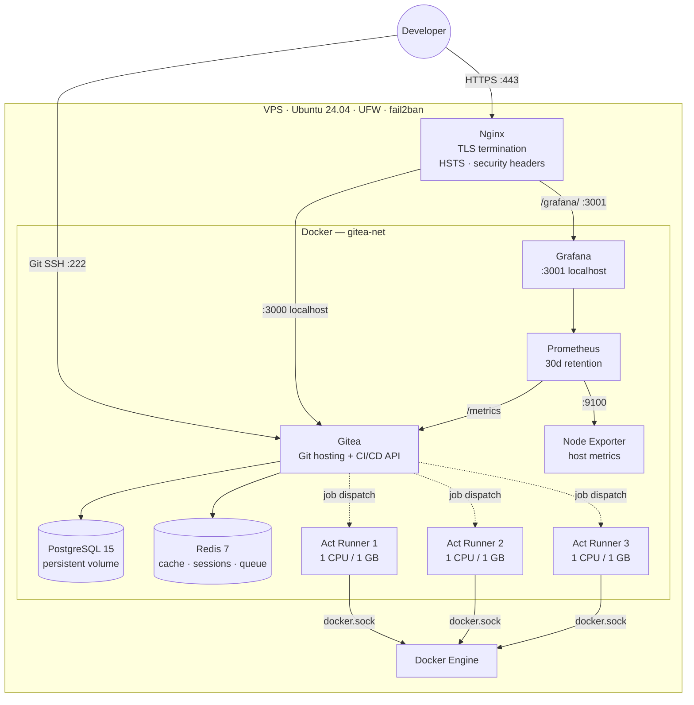
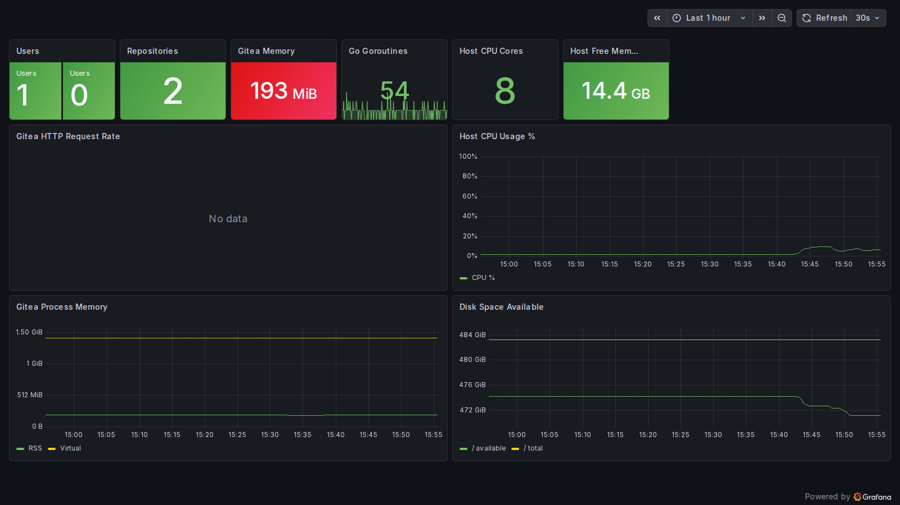
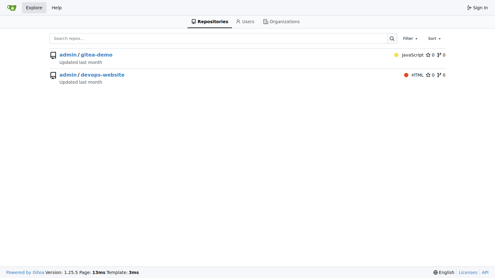
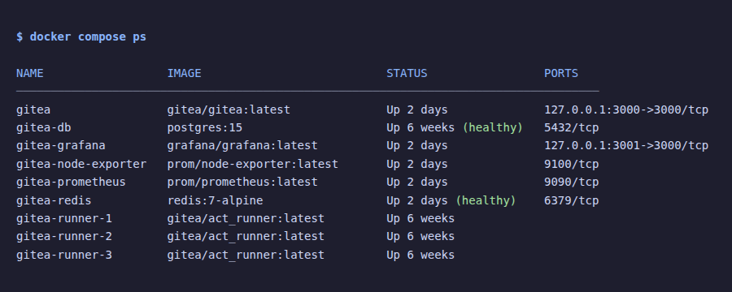

# Self-Hosted Gitea


Self-hosted [Gitea](https://gitea.io) stack with PostgreSQL, Redis, three Act Runners, Prometheus + Grafana monitoring, and Nginx + Let's Encrypt TLS.

Provisioned with **Terraform**, configured with **Ansible**, run on **Docker Compose** — one command from an empty cloud account to a running instance. If you already have a server, the original shell-script path still works and needs neither tool installed.

---

## Built for SMEs

Many small and medium-sized businesses pay $21–$50/user/month for GitHub Enterprise or GitLab SaaS. For a team of 50, that's up to $30,000/year — before CI/CD minutes. This stack runs the same core capabilities on a single $40/month VPS.

| Concern | How this stack addresses it |
|---|---|
| **Code ownership** | All source code stays on your own server — no third-party data exposure |
| **Cost** | Flat VPS cost regardless of team size; no per-seat or per-CI-minute billing |
| **CI/CD** | Three parallel Act Runners with GitHub Actions-compatible workflow syntax — no migration cost if teams already know GitHub Actions |
| **Access control** | Registration disabled by default; users provisioned by admins only |
| **Compliance** | Data never leaves your infrastructure — relevant for teams under GDPR, ISO 27001, or industry-specific data residency requirements |
| **Reliability** | Automated backups, scripted restore, and Grafana alerting keep the ops burden low for a small IT team |
| **Scale** | Comfortably supports 5–200 concurrent developers on modest hardware; Redis and PostgreSQL handle session and query load efficiently |
| **Onboarding** | One `make provision` from an empty cloud account, or `make bootstrap && make deploy` on a server you already have — no Kubernetes expertise required either way |
| **Reproducibility** | The server itself is declared in Terraform and configured by Ansible roles, so a lost host is rebuilt from version control rather than from memory |

---

## Skills Demonstrated

| Area | Detail |
|---|---|
| **Containerisation** | Docker Compose multi-service stack with health checks, dependency ordering, and resource limits |
| **Databases** | PostgreSQL 15 with persistent volumes; Redis 7 for caching, sessions, and async job queues |
| **Observability** | Prometheus metrics collection with 30-day retention; Grafana dashboards auto-provisioned via config |
| **Security** | UFW firewall, fail2ban brute-force protection, SSH hardening, TLS 1.3, HSTS, sysctl hardening |
| **Automation** | Fully scripted bootstrap, deploy, backup, restore, and OS hardening — idempotent and re-runnable |
| **CI/CD** | GitHub Actions pipeline: YAML lint, shellcheck, Trivy image scan, Trufflehog secrets detection, deploy dry-run |
| **Networking** | Nginx reverse proxy with automatic Let's Encrypt TLS, internal service isolation (ports bound to localhost) |
| **Provisioning** | Terraform declares the host, cloud firewall, and SSH key; state-managed with `prevent_destroy` on the data-bearing server |
| **Configuration management** | Ansible roles for hardening, Docker, TLS, deployment, and backup timers — tag-scoped so security config can be re-applied on its own |
| **Infrastructure as Code** | Empty cloud account to running instance in one `make provision`; the only handoff between layers is a Terraform-generated Ansible inventory |

---

## Architecture



---

## Screenshots

**Grafana Overview Dashboard** — live metrics: active users, repositories, Gitea CPU and memory usage, host CPU and disk



**Gitea Explore** — repository listing served over HTTPS via Nginx with Let's Encrypt TLS



**All 9 containers healthy** — Gitea, PostgreSQL, Redis, 3 Act Runners, Prometheus, Grafana, Node Exporter



---

## Stack

| Component | Image | Purpose |
|---|---|---|
| Gitea | `gitea/gitea:latest` | Git hosting, web UI, API, CI/CD |
| PostgreSQL | `postgres:15` | Primary database |
| Redis | `redis:7-alpine` | Cache, sessions, async queue |
| Act Runner ×3 | `gitea/act_runner:latest` | Parallel CI/CD job execution |
| Node Exporter | `prom/node-exporter:latest` | Host CPU, memory, disk metrics |
| Prometheus | `prom/prometheus:latest` | Metrics collection (30d retention) |
| Grafana | `grafana/grafana:latest` | Dashboards and alerting |
| Nginx (host) | system package | TLS termination, reverse proxy |

---

## How It's Built

Three layers, each with a single job and a clean handoff to the next:

```
terraform/   provisions the server, cloud firewall, and SSH key
     │       └── writes ansible/inventory/hosts.ini
     ▼
ansible/     hardens the OS, installs Docker, obtains TLS, ships the stack
     │       └── copies docker-compose.yml + .env to /opt/gitea
     ▼
docker/      runs the nine containers
```

The only contract between Terraform and Ansible is the generated inventory file, so swapping cloud provider means editing `terraform/main.tf` and nothing else.

The shell scripts in `scripts/` remain first-class: `bootstrap.sh` and `harden.sh` do the same work as the `docker`, `nginx_tls`, and `hardening` roles for anyone who would rather not install Ansible.

---

## Prerequisites

**Path A — provision from scratch (Terraform + Ansible)**

- [Terraform](https://developer.hashicorp.com/terraform/downloads) ≥ 1.5 and [Ansible](https://docs.ansible.com/ansible/latest/installation_guide/) on your workstation
- A Hetzner Cloud API token (Project → Security → API tokens, Read & Write)
- An SSH keypair (`~/.ssh/id_ed25519` by default)

**Path B — use a server you already have (shell scripts)**

- Ubuntu 22.04 or 24.04 VPS (2 CPU / 4 GB RAM minimum; 4 CPU / 8 GB recommended)
- SSH access as a user with `sudo`
- Ports 80, 222 open in your cloud provider's firewall (also 443 if using a domain with TLS)

**Both paths**

- **Domain deployment:** a domain name with an A record pointing to your server's IP
- **Bare-IP deployment:** no domain required — set `PROTOCOL=http` in `.env` and the bootstrap handles the rest

---

## Quick Start — Path A: provision from scratch

```bash
git clone https://github.com/kipngeno-isaac/self-hosted-gitea.git
cd self-hosted-gitea

cp terraform/terraform.tfvars.example terraform/terraform.tfvars
$EDITOR terraform/terraform.tfvars      # Hetzner token, region, SSH key paths

cp .env.example .env
$EDITOR .env                            # DOMAIN, passwords — see the table below

make provision                          # tf-init → tf-apply → ansible-deps → ansible-deploy
```

`make tf-apply` prints the server's IPv4 address. Point your `DOMAIN` A record at it **before** the Ansible run reaches the TLS step, or Let's Encrypt will fail the challenge. Then finish with the Gitea setup wizard (step 6 below).

Individual targets, if you would rather go one step at a time:

```bash
make tf-init         # download providers
make tf-plan         # preview infrastructure changes
make tf-apply        # create the server, generate the Ansible inventory
make ansible-deps    # install required Ansible collections
make ansible-check   # dry-run the playbook (--check --diff)
make ansible-deploy  # configure the host and start the stack
make ansible-harden  # re-apply security configuration only
```

> **Restrict SSH before treating the host as production.** `admin_cidrs` in `terraform.tfvars` defaults to the whole internet so that a first apply cannot lock you out. Narrow it to your own address once you have confirmed access.

> **`prevent_destroy` is set on the server** — it holds the Gitea repositories and the Postgres volume. `make tf-destroy` will refuse until you remove that lifecycle block, which is deliberate. Confirm your backups live off-host first.

---

## Quick Start — Path B: existing server

### 1. Clone onto your server

```bash
git clone https://github.com/kipngeno-isaac/self-hosted-gitea.git
cd self-hosted-gitea
```

### 2. Configure environment variables

```bash
cp .env.example .env
nano .env
```

| Variable | Description |
|---|---|
| `DOMAIN` | Your domain (`gitea.example.com`) or bare IP (`1.2.3.4`) |
| `PROTOCOL` | `https` for domain + TLS (default), `http` for bare-IP |
| `POSTGRES_PASSWORD` | Strong password for the database |
| `RUNNER_TOKEN` | Get from Gitea → Site Admin → Runners after first boot |
| `GRAFANA_PASSWORD` | Grafana admin password |
| `LETSENCRYPT_EMAIL` | Email for certificate expiry alerts (domain deployments only) |

> **Note:** Leave `RUNNER_TOKEN` as a placeholder for the first run. Fill it in after Gitea is up, then re-run `make deploy`.

> **Bare-IP tip:** Set `DOMAIN=<your-ip>` and `PROTOCOL=http`. Bootstrap will detect the IP, skip Let's Encrypt, and configure an HTTP-only Nginx proxy automatically.

### 3. Bootstrap the server

Installs Docker, Nginx, and Certbot. Automatically detects whether `DOMAIN` is a bare IP or a real domain:
- **Bare IP** — configures HTTP-only Nginx, skips Let's Encrypt
- **Domain** — obtains a Let's Encrypt TLS certificate and configures HTTPS

```bash
make bootstrap
```

### 4. Harden the OS

Configures UFW firewall, fail2ban, SSH hardening, and unattended security updates.

```bash
make harden
```

### 5. Deploy the stack

```bash
make deploy
```

Gitea will be available at `https://<your-domain>` within ~30 seconds.

### 6. Finish Gitea setup

1. Open `https://<your-domain>` in your browser.
2. Complete the setup wizard (database is pre-configured from `.env`).
3. Go to **Site Administration → Runners → Create Registration Token**.
4. Copy the token into `.env` as `RUNNER_TOKEN`.
5. Run `make deploy` again to register the three Act Runners.

---

## Monitoring

Prometheus scrapes Gitea metrics and host metrics every 15 seconds. Grafana ships with a pre-provisioned **Gitea Overview** dashboard.

### Access Grafana

Grafana is available publicly at **https://gitea.example.com/grafana** — served via the same Nginx reverse proxy as Gitea, no separate domain or port needed.

### What's monitored

- Gitea: users, repositories, organizations, HTTP request rate, memory, goroutines
- Host: CPU usage, memory available, disk space, network I/O

---

## CI/CD

Workflows live in `.gitea/workflows/` and use GitHub Actions-compatible syntax. This repo includes a reference pipeline (`.gitea/workflows/ci.yml`) that runs on every push:

| Job | What it does |
|---|---|
| `lint` | yamllint, shellcheck, docker compose config validation |
| `security-scan` | Trivy image scan, Trufflehog secrets detection |
| `deploy-dry-run` | Validates all `.env` variables resolve correctly |
| `notify` | Aggregates job results and fails the pipeline if any job failed |

---

## Day-to-Day Operations

```bash
make status            # container status + resource usage
make logs              # tail all logs
make logs-gitea        # tail Gitea logs only
make logs-gitea-db     # tail PostgreSQL logs only
make update            # pull latest images and restart
make restart           # restart all containers
make stop              # stop all containers
make backup            # backup data to ./backups/
make monitoring-up     # start monitoring stack
make monitoring-down   # stop monitoring stack
```

Infrastructure-level commands (run from your workstation, not the server):

```bash
make tf-plan           # preview infrastructure changes
make tf-apply          # apply them and refresh the Ansible inventory
make ansible-check     # dry-run the playbook against the live host
make ansible-harden    # re-apply security configuration only
```

### Admin CLI

```bash
make admin CMD="user list"
make admin CMD="user create --username alice --password secret --email alice@example.com --admin"
```

### Restore from backup

```bash
make restore DATA=backups/gitea-20260101_120000.tar.gz \
             DB=backups/gitea-db-20260101_120000.sql.gz
```

---

## Repository Structure

```
self-hosted-gitea/
├── .env.example                         # Variable template — copy to .env, never commit
├── .gitignore
├── terraform/                           # Layer 1 — provisions the server
│   ├── versions.tf                      # Required Terraform and provider versions
│   ├── providers.tf                     # Hetzner Cloud provider
│   ├── variables.tf                     # Region, server type, SSH keys, admin CIDRs
│   ├── main.tf                          # Server, cloud firewall, generated Ansible inventory
│   ├── outputs.tf                       # Server IP, SSH command, next steps
│   ├── terraform.tfvars.example         # Copy to terraform.tfvars — git-ignored
│   └── README.md
├── ansible/                             # Layer 2 — configures the server
│   ├── ansible.cfg
│   ├── site.yml                         # Entry point — runs every role in order
│   ├── requirements.yml                 # community.general, community.docker
│   ├── group_vars/all.yml               # Deploy paths, firewall ports, TLS toggle
│   ├── inventory/
│   │   └── hosts.ini.example            # hosts.ini itself is generated by Terraform
│   ├── roles/
│   │   ├── common/                      # Base packages, unattended security upgrades
│   │   ├── hardening/                   # UFW, fail2ban, sshd, sysctl
│   │   ├── docker/                      # Docker Engine + Compose plugin
│   │   ├── nginx_tls/                   # Nginx vhost, Let's Encrypt, bare-IP fallback
│   │   ├── gitea_stack/                 # Ships the compose stack, waits for health
│   │   └── backups/                     # systemd timer running backup.sh nightly
│   └── README.md
├── .gitea/
│   └── workflows/
│       └── ci.yml                       # Gitea Actions pipeline (runs on the self-hosted instance)
├── .github/
│   └── workflows/
│       └── ci.yml                       # GitHub Actions pipeline (lint, security scan, dry-run)
├── Makefile                             # All day-to-day commands (deploy, backup, harden, etc.)
├── docker-compose.yml                   # Full application stack definition
├── docs/
│   └── screenshots/                     # Live screenshots embedded in README
├── monitoring/
│   ├── prometheus.yml                   # Scrape config (Gitea + node-exporter)
│   └── grafana/
│       └── provisioning/
│           ├── datasources/
│           │   └── prometheus.yml       # Prometheus datasource (auto-provisioned)
│           └── dashboards/
│               ├── dashboards.yml       # Dashboard provider config
│               └── gitea-overview.json  # Gitea Overview dashboard (auto-provisioned)
├── nginx/
│   ├── gitea.conf.template              # Nginx HTTPS config (domain + Let's Encrypt)
│   └── gitea-http.conf.template         # Nginx HTTP-only config (bare-IP deployments)
├── scripts/
│   ├── bootstrap.sh                     # One-time server setup (Docker, Nginx, Certbot)
│   ├── deploy.sh                        # Start / update the stack
│   ├── harden.sh                        # UFW, fail2ban, SSH hardening, sysctl
│   ├── backup.sh                        # Backup data volume + PostgreSQL dump
│   └── restore.sh                       # Restore from backup
├── README.md
└── SECURITY.md                          # Threat model, controls, reporting
```

---

## Ports

| Port | Protocol | Exposed | Purpose |
|---|---|---|---|
| 80 | HTTP | Public | Nginx — HTTPS redirect (domain) or direct proxy (bare-IP) |
| 443 | HTTPS | Public | Gitea web UI, API, webhooks (domain deployments only) |
| 222 | SSH | Public | Git over SSH |
| 3000 | HTTP | localhost only | Gitea (via Nginx) |
| 3001 | HTTP | localhost only | Grafana (proxied via Nginx at `/grafana/`) |

**SSH clone URL:** `ssh://git@<your-domain>:222/<org>/<repo>.git`

---

## Security

See [SECURITY.md](SECURITY.md) for the full threat model, hardening controls, and vulnerability reporting.

Quick summary:
- Registration disabled by default — users created via admin CLI
- Port 3000 bound to `127.0.0.1` only
- Two independent firewall layers: the Hetzner cloud firewall drops traffic before it reaches the host, UFW protects against a misconfigured cloud firewall. Both rule sets must be kept in step — see `terraform/main.tf` and `ansible/group_vars/all.yml`
- fail2ban brute-force protection on sshd, nginx auth, and Gitea login
- TLS 1.2/1.3 only with HSTS
- Secrets in `.env` and `terraform.tfvars` (both git-ignored, along with Terraform state)
- Automated security updates via unattended-upgrades

---

## Migrating an Existing Instance

1. Run `make backup` on the old server.
2. Copy the two backup files to the new server.
3. Follow Quick Start steps 1–5 on the new server (skip the Gitea wizard — restore handles it).
4. Run `make restore DATA=... DB=...`.

---

## Updating

```bash
make update
```

Pulls latest images for all services and restarts with zero downtime for the runners.
