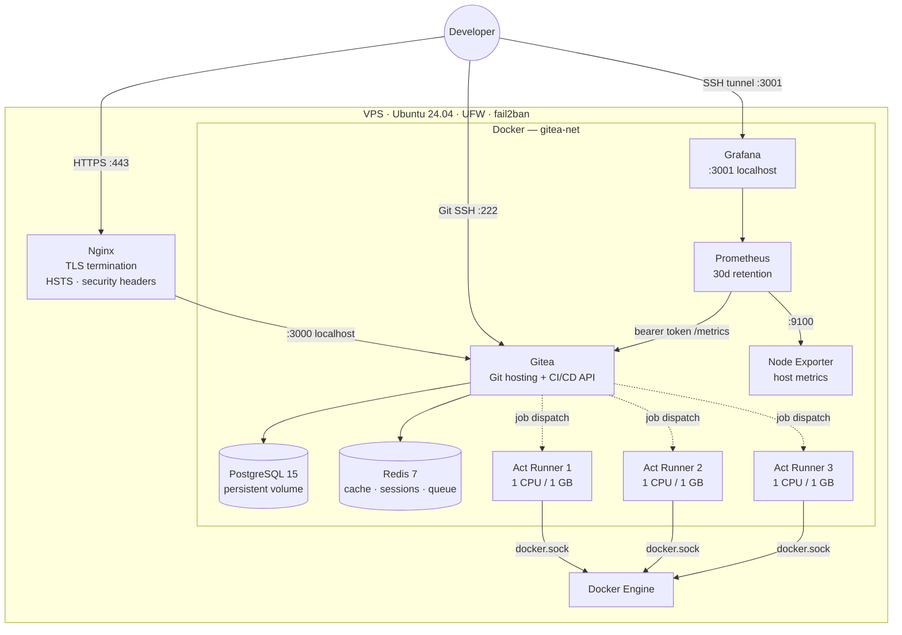

# Gitea IaC

Self-hosted [Gitea](https://gitea.io) stack with PostgreSQL, Redis, three Act Runners, Prometheus + Grafana monitoring, and Nginx + Let's Encrypt TLS. Fully automated — one command from a bare Ubuntu VPS to a running instance.

---

## Architecture



---

## Stack

| Component | Image | Purpose |
|---|---|---|
| Gitea | `gitea/gitea:latest` | Git hosting, web UI, API, CI/CD |
| PostgreSQL | `postgres:15` | Primary database |
| Redis | `redis:7-alpine` | Cache, sessions, async queue |
| Act Runner ×3 | `gitea/act_runner:latest` | Parallel CI/CD job execution |
| Node Exporter | `prom/node-exporter:latest` | Host CPU, memory, disk metrics |
| Prometheus | `prom/prometheus:latest` | Metrics collection (30d retention) |
| Grafana | `grafana/grafana:latest` | Dashboards and alerting |
| Nginx (host) | system package | TLS termination, reverse proxy |

---

## Prerequisites

- Ubuntu 22.04 or 24.04 VPS (2 CPU / 4 GB RAM minimum; 4 CPU / 8 GB recommended)
- A domain name with an A record pointing to your server's public IP
- SSH access as a user with `sudo`
- Ports 80, 443, and 222 open in your cloud provider's firewall

---

## Quick Start

### 1. Clone onto your server

```bash
git clone https://github.com/<your-org>/gitea-iac.git
cd gitea-iac
```

### 2. Configure environment variables

```bash
cp .env.example .env
nano .env
```

| Variable | Description |
|---|---|
| `DOMAIN` | Your domain, e.g. `gitea.example.com` |
| `POSTGRES_PASSWORD` | Strong password for the database |
| `RUNNER_TOKEN` | Get from Gitea → Site Admin → Runners after first boot |
| `METRICS_TOKEN` | Random string used to protect the `/metrics` endpoint |
| `GRAFANA_PASSWORD` | Grafana admin password |
| `LETSENCRYPT_EMAIL` | Email for certificate expiry alerts |

> **Note:** Leave `RUNNER_TOKEN` as a placeholder for the first run. Fill it in after Gitea is up, then re-run `make deploy`.

### 3. Bootstrap the server

Installs Docker, Nginx, Certbot, and obtains a TLS certificate.

```bash
make bootstrap
```

### 4. Harden the OS

Configures UFW firewall, fail2ban, SSH hardening, and unattended security updates.

```bash
make harden
```

### 5. Deploy the stack

```bash
make deploy
```

Gitea will be available at `https://<your-domain>` within ~30 seconds.

### 6. Finish Gitea setup

1. Open `https://<your-domain>` in your browser.
2. Complete the setup wizard (database is pre-configured from `.env`).
3. Go to **Site Administration → Runners → Create Registration Token**.
4. Copy the token into `.env` as `RUNNER_TOKEN`.
5. Run `make deploy` again to register the three Act Runners.

---

## Monitoring

Prometheus scrapes Gitea metrics and host metrics every 15 seconds. Grafana ships with a pre-provisioned **Gitea Overview** dashboard.

### Access Grafana

Grafana is bound to `127.0.0.1:3001` and not exposed publicly. Access it via SSH tunnel:

```bash
make grafana        # prints the exact ssh command
# Then open: http://localhost:3001
```

### What's monitored

- Gitea: users, repositories, organizations, HTTP request rate, memory, goroutines
- Host: CPU usage, memory available, disk space, network I/O

---

## CI/CD

Workflows live in `.gitea/workflows/` and use GitHub Actions-compatible syntax. This repo includes a reference pipeline (`.gitea/workflows/ci.yml`) that runs on every push:

| Job | What it does |
|---|---|
| `lint` | yamllint, shellcheck, docker compose config validation |
| `security-scan` | Trivy image scan, Trufflehog secrets detection |
| `deploy-dry-run` | Validates all `.env` variables resolve correctly |
| `notify` | Aggregates job results and fails the pipeline if any job failed |

---

## Day-to-Day Operations

```bash
make status            # container status + resource usage
make logs              # tail all logs
make logs-gitea        # tail Gitea logs only
make logs-gitea-db     # tail PostgreSQL logs only
make update            # pull latest images and restart
make restart           # restart all containers
make stop              # stop all containers
make backup            # backup data to ./backups/
make monitoring-up     # start monitoring stack
make monitoring-down   # stop monitoring stack
```

### Admin CLI

```bash
make admin CMD="user list"
make admin CMD="user create --username alice --password secret --email alice@example.com --admin"
```

### Restore from backup

```bash
make restore DATA=backups/gitea-20260101_120000.tar.gz \
             DB=backups/gitea-db-20260101_120000.sql.gz
```

---

## Repository Structure

```
gitea-iac/
├── .env.example
├── .gitignore
├── .gitea/
│   └── workflows/
│       └── ci.yml                  # Reference CI/CD pipeline
├── Makefile
├── docker-compose.yml
├── monitoring/
│   ├── prometheus.yml              # Scrape config
│   └── grafana/
│       └── provisioning/
│           ├── datasources/        # Prometheus datasource (auto-provisioned)
│           └── dashboards/         # Gitea Overview dashboard (auto-provisioned)
├── nginx/
│   └── gitea.conf.template
├── scripts/
│   ├── bootstrap.sh
│   ├── deploy.sh
│   ├── harden.sh
│   ├── backup.sh
│   └── restore.sh
├── README.md
└── SECURITY.md
```

---

## Ports

| Port | Protocol | Exposed | Purpose |
|---|---|---|---|
| 80 | HTTP | Public | Nginx → HTTPS redirect |
| 443 | HTTPS | Public | Gitea web UI, API, webhooks |
| 222 | SSH | Public | Git over SSH |
| 3000 | HTTP | localhost only | Gitea (via Nginx) |
| 3001 | HTTP | localhost only | Grafana (via SSH tunnel) |

**SSH clone URL:** `ssh://git@<your-domain>:222/<org>/<repo>.git`

---

## Security

See [SECURITY.md](SECURITY.md) for the full threat model, hardening controls, and vulnerability reporting.

Quick summary:
- Registration disabled by default — users created via admin CLI
- Port 3000 bound to `127.0.0.1` only
- UFW firewall + fail2ban brute-force protection
- TLS 1.2/1.3 only with HSTS
- Secrets in `.env` (git-ignored)
- Automated security updates via unattended-upgrades

---

## Migrating an Existing Instance

1. Run `make backup` on the old server.
2. Copy the two backup files to the new server.
3. Follow Quick Start steps 1–5 on the new server (skip the Gitea wizard — restore handles it).
4. Run `make restore DATA=... DB=...`.

---

## Updating

```bash
make update
```

Pulls latest images for all services and restarts with zero downtime for the runners.
